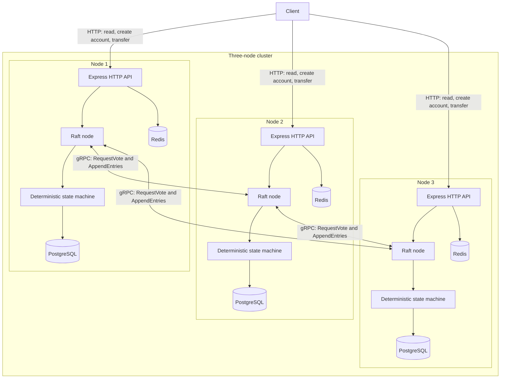
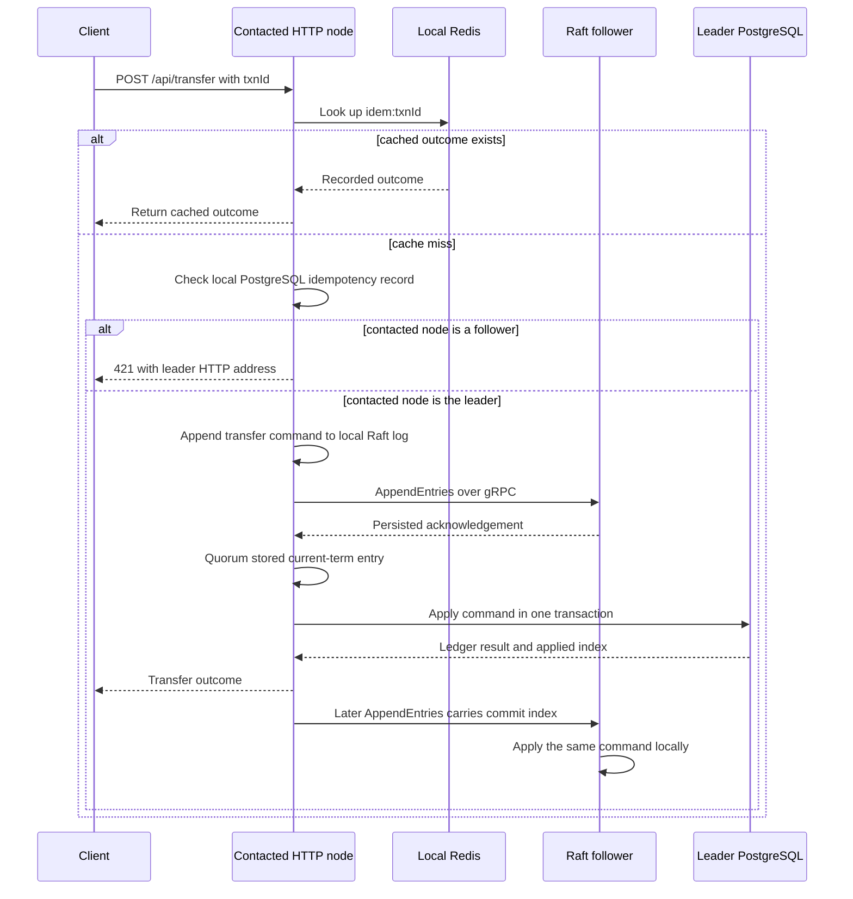

# Distributed Money System

A three-replica money ledger that orders transfers with Raft before applying them to independent local databases. A client may contact any HTTP node, but only the elected leader accepts a new transfer command. A replica that has already applied a transaction may return its cached outcome. Once a quorum has stored a command, every replica eventually applies the same deterministic state-machine transition and arrives at the same balances and ledger hash chain.

The project is deliberately small enough to study end to end: Express exposes the HTTP API, gRPC carries Raft traffic, PostgreSQL holds both the Raft and ledger state, and Redis accelerates idempotent retries without becoming the source of truth.

## What the system guarantees

- Transfers are ordered by a Raft leader and committed only after a quorum acknowledges the log entry.
- A transfer request is keyed by `txnId`; repeating the same key returns the recorded outcome instead of moving money twice.
- Each replica applies committed commands in log order. Balance changes, the append-only ledger entry, the idempotency record, and the applied-log marker are committed in one database transaction.
- Ledger records are hash chained. `GET /api/verify` recomputes the chain and detects a broken predecessor link or entry hash.
- Amounts are handled as integer paise with `BigInt`, never floating-point values.

These guarantees apply to transfers. Creating an account is a local operation and must be performed on every replica before that account can participate in a replicated transfer. See [Important operating limits](#important-operating-limits).

## Architecture



Each application node owns its own PostgreSQL and Redis instance. There is no shared database behind the replicas: a shared database would bypass the replicated-state-machine model. The Docker Compose configuration gives each application node a distinct database and cache connection.

### Local and published addresses

| Replica | Published HTTP | Published gRPC | PostgreSQL | Redis |
| --- | ---: | ---: | ---: | ---: |
| `node-1` | `3001` | `6001` | `5433` | `6390` |
| `node-2` | `3002` | `6002` | `5434` | `6391` |
| `node-3` | `3003` | `6003` | `5435` | `6392` |

Inside the Compose network, every application container listens on the same HTTP and gRPC addresses. Docker publishes different host ports for the second and third replicas. Cluster membership comes from `CLUSTER`, whose entries have this form:

```text
node-id@grpc-host:grpc-port|http-base-address
```

The gRPC address is used for Raft RPCs. The HTTP address is returned to clients when they contact a follower and need to retry against the leader.

### Main components

| Area | Responsibility | Primary code |
| --- | --- | --- |
| HTTP server | Parses JSON, mounts routes, starts Raft, and handles shutdown. | `src/server.js` |
| HTTP API | Validates requests and exposes accounts, transfers, verification, and status. | `src/routes/`, `src/controllers/` |
| Raft node | Holds volatile consensus state, runs timers, owns proposal waiters, and applies committed entries. | `src/raft/raftNode.js` |
| Election | Starts elections after missing leader traffic and handles votes. | `src/raft/election.js` |
| Replication | Sends and processes `AppendEntries`, reconciles logs, and advances the commit index. | `src/raft/replication.js` |
| RPC transport | Loads the protobuf contract and creates gRPC clients and server handlers. | `src/raft/rpc.js`, `src/proto/raft.proto` |
| State machine | Applies a committed transfer exactly once inside a local database transaction. | `src/services/stateMachine.js` |
| Ledger service | Implements local account access, transfer request handling, idempotency lookup, and chain verification. | `src/services/ledgerService.js` |
| Persistence | Stores accounts, ledger records, idempotency records, Raft metadata, and Raft log entries. | `src/models/`, `migrations/` |

## Transfer lifecycle



The actual request path is as follows:

1. The controller validates `txnId`, account IDs, and `amountPaise`. Positive transfer amounts are required.
2. `ledgerService.transfer()` checks the local Redis key `idem:<txnId>`. A cache hit is safe because only an already-applied outcome is stored there.
3. On a cache miss, it checks local PostgreSQL's `idempotency` table. This table is authoritative when Redis is cold or unavailable.
4. A follower rejects the proposal with HTTP `421` and provides `leaderId` and `leaderHttp` in the response body. It also sets `X-Leader-Address` when known. The client must retry there; the service does not issue an automatic redirect.
5. The leader serializes the read-tail-and-append operation, writes the command to `raft_log`, and immediately sends `AppendEntries` to both peers.
6. Once a majority has the entry, the leader advances its commit index only when the entry belongs to the leader's current term.
7. The leader's apply loop calls the state machine. The state machine locks the two account rows in sorted order, records either the successful result or a business rejection, and advances `last_applied_index` in the same transaction.
8. Followers learn the new commit index through subsequent `AppendEntries` traffic, then execute the same state-machine command in log order.
9. The leader caches the applied response in Redis and returns it. A retry with the same `txnId` receives that same recorded result.

An insufficient balance, an unknown account, or the same source and destination account is also recorded as an idempotent state-machine outcome. That matters: all replicas reach the same result for a committed command, including a rejected one.

## How consensus works here

### Election

Every node starts as a follower and tracks the time of the most recent valid leader heartbeat. If that time exceeds a randomized election timeout, the node:

1. Persists a new term and its self-vote before making any RPC.
2. Becomes a candidate and sends `RequestVote` calls to all peers in parallel.
3. Becomes leader after receiving a quorum of votes.
4. Appends a no-op entry, initializes follower replication positions, and starts periodic `AppendEntries` heartbeats.

A node steps down if it learns of a higher term. If a leader steps down while client proposals are waiting, those requests fail so the client can safely retry with the same `txnId`.

### Replication and commit

For each follower, a leader tracks `nextIndex` and `matchIndex`. `AppendEntries` includes the preceding log index and term, so a follower can reject a request when its log does not match the leader's prefix. The rejection supplies a conflict index; the leader uses that hint to rewind efficiently instead of backing up one entry at a time.

Before appending new entries, a follower performs any required conflict truncation and append inside one PostgreSQL transaction. A command becomes committed after a quorum has stored it. The leader only advances `commitIndex` for entries from its current term, which prevents an older inherited entry from being treated as committed too early.

### Persistent state

Each replica stores this consensus state in its own database:

- `raft_meta`: current term, vote target, and the final applied log index.
- `raft_log`: ordered command and no-op entries.

The database is configured to synchronously commit writes. On restart, a node restores this metadata, sets its volatile commit index to its recorded applied index, starts gRPC, and re-enters the election process.

## Data model and integrity

### Accounts

`accounts` holds the current balance for each account. `openingBalancePaise` and transfer amounts are integer paise values. The input boundary accepts an integer string or a safe integer, then converts it to `BigInt`; decimal amounts and unsafe numeric values are rejected.

During an applied transfer, the state machine selects both accounts with `FOR UPDATE` in lexical ID order. Taking locks in one deterministic order avoids a deadlock when concurrent transfers involve the same accounts in opposite directions.

### Ledger and hash chain

`ledger` is append-only at the database layer: update and delete rules discard those operations. Each record stores:

- the transaction ID, source account, destination account, and amount;
- the previous entry hash; and
- a SHA-256 hash of `previous hash | transaction ID | source | destination | amount`.

The first record uses a fixed all-zero predecessor hash. `GET /api/verify` loads ledger records in order and checks both the predecessor link and the recomputed hash.

### Exactly-once application

The `idempotency` table maps a transaction ID to the HTTP outcome body. In a single local transaction, the state machine can write the ledger record, update both account balances, insert the idempotency record, and move `last_applied_index` forward. If a process stops after that transaction commits, replay begins after the recorded index and does not apply the command a second time.

Redis is only a time-limited fast path for this data. A missing cache entry cannot create a duplicate transfer because PostgreSQL and the state machine remain authoritative.

## Run the cluster

### Prerequisites

- Docker with the Compose plugin
- Node.js and npm for host-side tests
- `curl` for the examples
- A Bash-compatible shell for the chaos script

### Start

```bash
docker compose up --build -d
docker compose ps
docker compose logs -f node1
```

Each application container runs database migrations before starting its HTTP server. Wait until one status endpoint reports `"state":"LEADER"` before sending transfers.

```bash
curl -s http://localhost:3001/api/raft/status
curl -s http://localhost:3002/api/raft/status
curl -s http://localhost:3003/api/raft/status
```

Stop the stack while retaining its data:

```bash
docker compose down
```

To remove the named PostgreSQL volumes and start with an empty ledger, run the following destructive command:

```bash
docker compose down -v
```

## Use the HTTP API

All amounts below are paise. For example, `25000` represents 250.00 rupees.

### Create accounts on every replica

Account creation is not a Raft command. Seed the same accounts on all three HTTP nodes before making a transfer.

```bash
for port in 3001 3002 3003; do
  curl -sS -X POST "http://localhost:${port}/api/accounts" \
    -H 'content-type: application/json' \
    -d '{"accountId":"alice","openingBalancePaise":"100000"}'
  curl -sS -X POST "http://localhost:${port}/api/accounts" \
    -H 'content-type: application/json' \
    -d '{"accountId":"bob","openingBalancePaise":"0"}'
done
```

On a freshly initialized cluster, `alice` starts with 1000.00 rupees and `bob` with zero.

### Submit a transfer

You may send a request to any node. If it is not the leader, read `error.leaderHttp` from the `421` response and retry the identical request at that address.

```bash
curl -i -X POST http://localhost:3001/api/transfer \
  -H 'content-type: application/json' \
  -d '{"txnId":"payment_001","from":"alice","to":"bob","amountPaise":"25000"}'
```

A successful first submission returns `201`. Repeating the same `txnId` returns the recorded result with `200` and `cached: true`.

### Read local balances

```bash
curl -s http://localhost:3001/api/accounts/alice
curl -s http://localhost:3002/api/accounts/alice
curl -s http://localhost:3003/api/accounts/alice
```

After a committed transfer, the replicas converge to the same balance. A follower read is local and can briefly lag behind the leader; it is not a linearizable read path.

### Check consensus and ledger integrity

```bash
curl -s http://localhost:3001/api/raft/status
curl -s http://localhost:3001/api/verify
```

`/api/raft/status` reports the node ID, role, current term, known leader, commit index, applied index, and peer IDs. `/api/verify` returns `{ "ok": true }` when the local hash chain is intact.

### Endpoint reference

| Method | Path | Purpose |
| --- | --- | --- |
| `POST` | `/api/accounts` | Create one local account with an opening balance. |
| `GET` | `/api/accounts/:accountId` | Read one local account balance. |
| `POST` | `/api/transfer` | Propose one replicated transfer to the Raft leader. |
| `GET` | `/api/verify` | Verify the local ledger hash chain. |
| `GET` | `/api/raft/status` | Inspect local Raft state. |
| `GET` | `/health` | Check HTTP process health and node identity. |

### Important HTTP outcomes

| Status | Meaning |
| ---: | --- |
| `201` | A new account or transfer request completed. |
| `200` | A read succeeded, a hash chain is valid, or a transfer retry returned cached data. |
| `400` | Validation failed, amount is invalid, the account pair is invalid, or a committed business rule rejected the transfer. |
| `404` | An account referenced by a read or transfer is absent on that replica. |
| `409` | A local account ID already exists. |
| `421` | The contacted node is not leader. Retry at the returned leader address. |
| `503` | Raft is not ready, the leader changed during the request, or the proposal did not apply before the request timeout. Retry with the same transaction ID. |

## Test and failure exercise

Install host dependencies once:

```bash
npm install
```

Run deterministic unit tests without the cluster:

```bash
npm run test:unit
```

With the Docker stack running, execute the full test set:

```bash
npm test
```

The cluster tests elect a leader, create accounts on every replica, submit a transfer, compare converged balances, replay a transaction ID, and verify each local hash chain.

Run the failure exercise with the stack already running:

```bash
npm run chaos
```

The script seeds `chaos_A` and `chaos_B` on every replica, stops the elected leader, waits for the surviving quorum to elect a replacement, transfers through that replacement, verifies its hash chain, restarts the stopped node, and prints the final replicated state.

## Configuration

Copy `.env.example` when running a node outside Compose. The most important settings are:

| Setting | Used for |
| --- | --- |
| `NODE_ID` | Identifies this application node in cluster membership. |
| `CLUSTER` | Lists every node's ID, gRPC address, and client-visible HTTP address. |
| `HTTP_PORT` and `GRPC_PORT` | Bind the HTTP API and Raft gRPC server. |
| `DATABASE_URL` | Connect to this node's private PostgreSQL instance. |
| `REDIS_URL` | Connect to this node's private idempotency cache. |
| `RAFT_HEARTBEAT_MS` | Controls leader heartbeat frequency. |
| `RAFT_ELECTION_TIMEOUT_MIN_MS` and `RAFT_ELECTION_TIMEOUT_MAX_MS` | Define the randomized election window. |
| `RAFT_MAX_BATCH` | Limits entries included in one replication request. |
| `RAFT_PROPOSE_TIMEOUT_MS` | Bounds how long an HTTP transfer waits for local application. |
| `IDEMPOTENCY_TTL_SECONDS` | Sets the Redis lifetime for cached outcomes. |

All replicas must agree on `CLUSTER`. A node whose ID is absent from that list refuses to start.

## Important operating limits

- Account creation is local, not replicated. Create each account with the same opening balance on every replica before referencing it in a transfer.
- Reads from `/api/accounts/:accountId` are served from the contacted node's database and may be temporarily stale on a follower.
- A three-member cluster needs two available replicas to make progress. Without a quorum, no leader can safely commit new transfers.
- The implementation has no snapshot-install RPC or log compaction. The Raft log therefore grows with the number of proposals.
- gRPC uses insecure transport and Compose publishes service ports to the host. This is suitable for local study; a deployed environment needs network isolation, authenticated client access, and encrypted inter-node transport.
- A `421` response is a retry instruction, not an HTTP redirect. Callers must preserve the original `txnId` when retrying.

## Reading order

For a code walkthrough, start at the entry point and follow a transfer from the edge to durable state:

1. `src/server.js` — process startup, routes, Raft lifecycle, and shutdown.
2. `src/routes/transferRoutes.js` and `src/controllers/transferController.js` — request validation and HTTP responses.
3. `src/services/ledgerService.js` — cache lookup, leader handling, proposal errors, and chain verification.
4. `src/raft/raftNode.js` — proposal serialization, timers, commit application, and singleton access.
5. `src/raft/election.js` and `src/raft/replication.js` — vote rules, heartbeats, log matching, and quorum commit.
6. `src/raft/rpc.js` and `src/proto/raft.proto` — the inter-node wire contract.
7. `src/services/stateMachine.js` — deterministic account and ledger mutation.
8. `src/models/` and `migrations/` — the durable schema and queries behind the above flow.
9. `tests/cluster.test.js` and `tests/chaos/leader-kill.sh` — the expected behavior under replication and leader loss.
